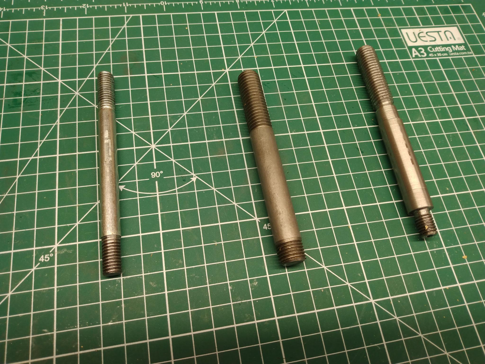
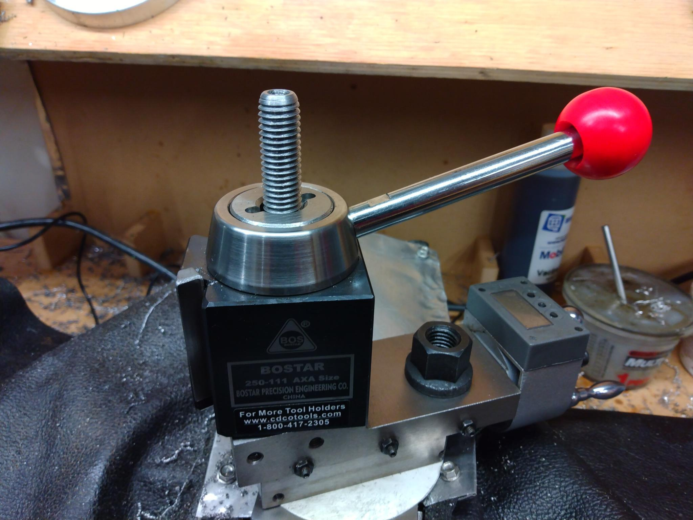
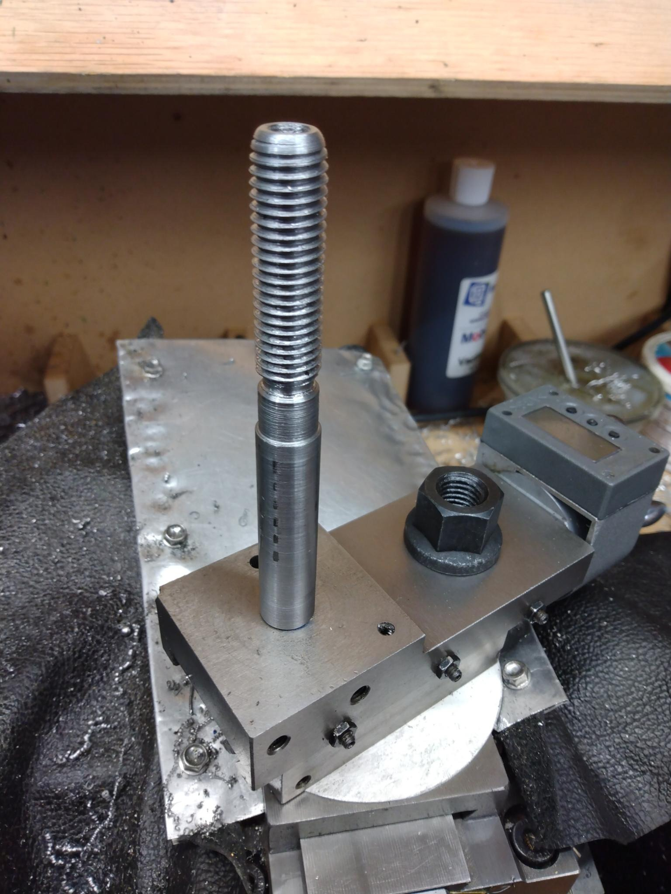

# Workshop

My workshop tools and designs.

## Projects

I'm building out a workshop, here are my tools.

* [tool post](./projects/tool-post)
* [panel saw](./projects/panel-saw)

## Notes

### tool-post

Like all mini-lathe owners, I ordered an AXA tool post. Well, first I ordered a BXA but that 
was ridiculously large. So then I ordered an AXA. However, the AXA tool post expects a different
thread on the bottom, and I didn't want to modify my cross slide compound any more than I
already have. So I needed to build an adapter post.

I started with raw stock and machined it to nominal size:

In retrospect, I need to cut my stock longer to give me room to work around the chuck and
the tailstock.

After much whittling away of material, I finally crafted a somewhat janky tool post:

The post on the left is a bolt that is used to bootstrap me into the new tool post. I
needed to do this b/c all my thread cutting bits are 1/2" for the new AXA post and 
holders. I used the modified bolt to machine the new tool post, on the right.

Here's the completed tool post installing into the compound:

And finally, the AXA tool post all assembled and ready for business:

## freecad

https://github.com/realthunder/FreeCAD

    OS: Ubuntu 20.04.3 LTS (ubuntu:GNOME/ubuntu)
    Word size of OS: 64-bit
    Word size of FreeCAD: 64-bit
    Version: 2021.1015.24301 +3962 (Git) AppImage
    Build type: Release
    Branch: LinkStage3
    Hash: c6cb39697eb439caf7e5bd0208ca3082a7820547
    Python version: 3.9.7
    Qt version: 5.12.9
    Coin version: 4.0.1
    OCC version: 7.5.2
    Locale: English/United States (en_US)
