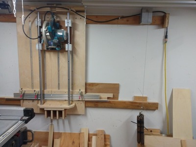

# Workshop

I'm improving my shop by increasing the size, precision and accuracy of what I (and my shop) is capable of.

## Projects

### Built

I'm building out a workshop, here's what I've built so far...

#### [tool post](./projects/tool-post/readme.md)

The tool post project helped me wrap my head around blogging in a github account. So that was bootstrap zero, get the documentation path
sorted out. In the past, I have blogged using git repo as a backing store, and then pushing the blog to a webserver with a static site
generator. Not terrible, but I am way too lazy/busy for that now. A git repo, some photos resized with imagemagik, and vim are all
I need for this.

#### [panel saw](./projects/panel-saw/readme.md)

So, with the lathe operational, I proceeded to the first woodworking tool I really needed, which is a panel saw. I have watched all of
JSK's utube videos, and once he built this saw, almost every subsequent project started with this saw. So I built one. And I can say,
now, every woodworking project uses this saw... this plus a table saw are an invaluable combination. 

#### [mason bee house](./projects/mason-bee-house/readme.md)

I tested out the panel saw by building the mason bee house. It rocked. I loved using the saw, and thoroughly enjoyed building the bee house.

#### [saw table](./projects/table-saw-cabinet/readme.md)

After that, I needed to upgrade the table saw. Dragging it off a shelf and then setting it up on saw horses for each use was a 
tremendous pain. Now that I have it mounted on a rolling cabinet, I can use it at any time. My productivity has skyrocketed now that
I don't have any setup time to deal with.

#### [router table](./projects/router-table-cabinet/readme.md)

With a functioning table saw and panel saw, the next thing (for me) was to find a home for my router table. This can function as 
a poor-man's joiner and do lots of other things, too. If I didn't already have a router table, there might have been a more pressing
tool cabinet, but for me, this seemed logical.

#### [chop saw table](./projects/chop-saw-table/readme.md)

Now, the panel saw can function as a chop saw. Except that I goofed a bit. The current implementation of my panel saw does not 
have enough clearance for 2x lumber. It will, once I replace the sled base and/or replace the vertical supports for the linear
rails. But, it works great as-is for plywood, so we'll see if that fix ever happens. Meanwhile, a salvaged cabinets plus some
wheels did the trick.

#### [disc sander](./projects/disc-sander/readme.md)

A disc sander is the next step in the tool chain progression.

### TODO

### [honey bees](./projects/honey-bees/readme.md)

* TODO: update the honey bee project.

### more projects on deck
* metal work table
* disc sander

## design tools

### freecad

I'm learning [FreeCAD](https://www.freecad.org/). I have a love hate relationship with this. However, after watching
about 200 hours of tutorial videos, I think I finally get it. I vastly prefer to support FOSS rather than become
vendor locked into a proprietary (and expensive) product.

    OS: Ubuntu 20.04.3 LTS (ubuntu:GNOME/ubuntu)
    Word size of OS: 64-bit
    Word size of FreeCAD: 64-bit
    Version: 0.19.24366 (Git) AppImage
    Build type: Release
    Branch: (HEAD detached at 0f9259c)
    Hash: 0f9259cda103ae1824ac16c68ac9b4a0d54b05fc
    Python version: 3.9.7
    Qt version: 5.12.9
    Coin version: 4.0.0
    OCC version: 7.5.3
    Locale: English/United States (en_US)

