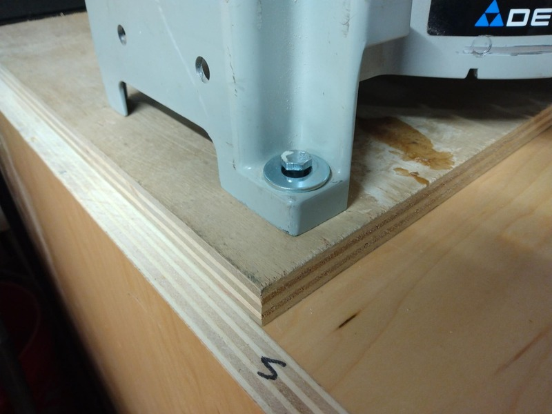
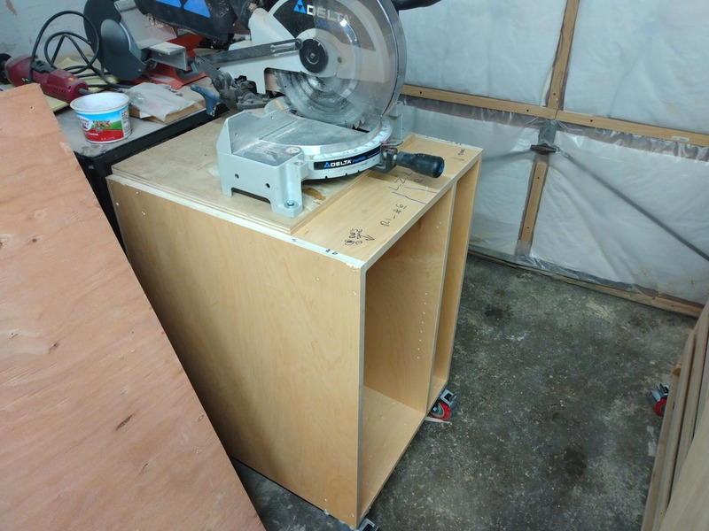
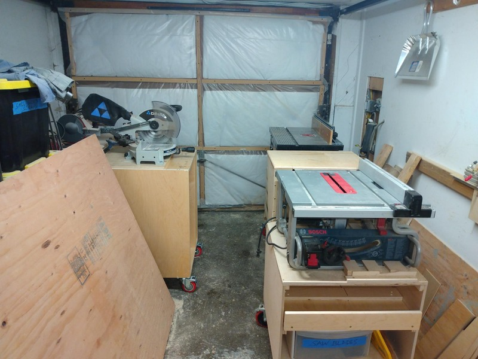

# chop saw table

I need a chop saw table that I can wheel into the driveway.

## implementation

I found this cabinet outside the cabinet shop with a free sign on it. So I carried it home. It was kind of heavy.

But, a simple scrap of 1.8cm plywood under the base and some 4" castors and it's good to go.

* 
* 
* 

