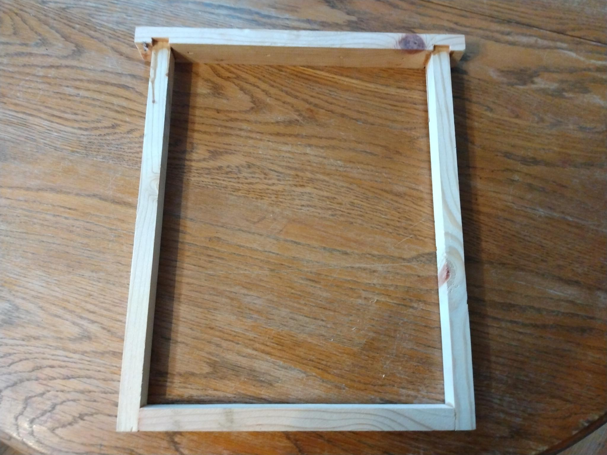
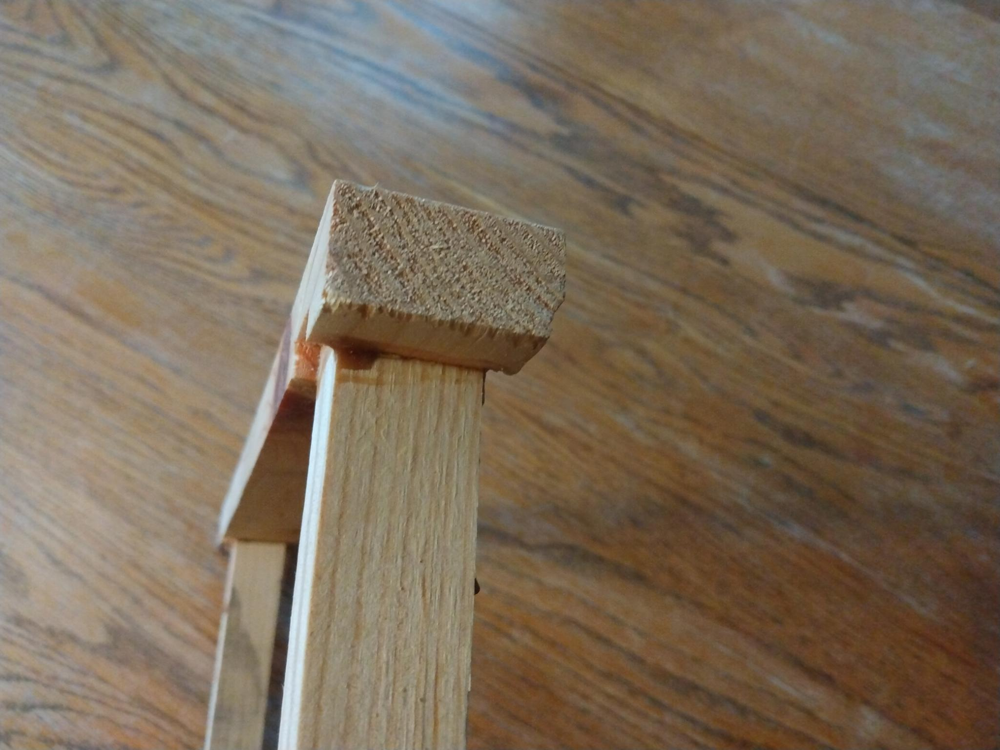
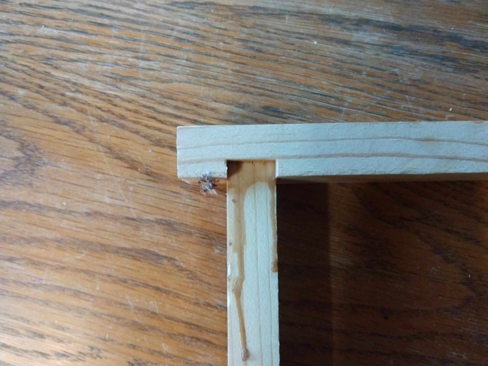
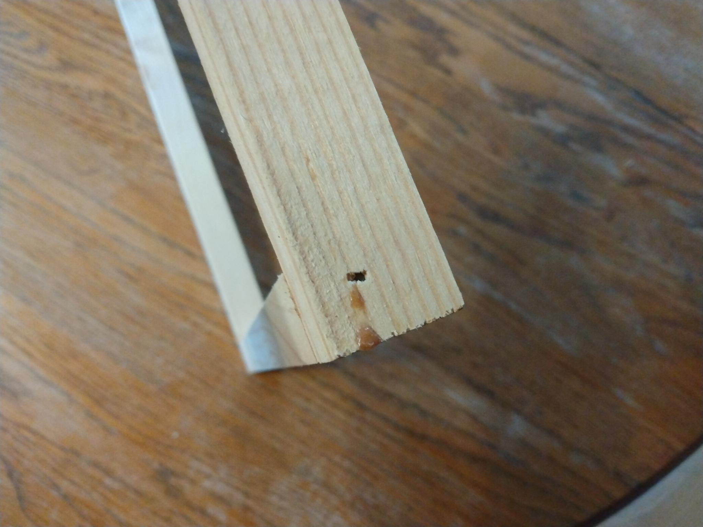

# honey bees

Honey bees are cool.

## projects

### layens frames

Simplified frame. Sturdy, and easy to build.

* 

Photos:

* 
* 
* 
* 

### layens hive

TODO (inproc)

## links

* https://www.youtube.com/results?search_query=dr+leo+sharashkin
* https://horizontalhive.com/keeping-bees-with-a-smile/georges-layens-book.shtml
* https://horizontalhive.com/keeping-bees-with-a-smile/fedor-lazutin-book.shtml
* https://horizontalhive.com/how-to-build/layens-hive-frame-plans.shtml
* https://horizontalhive.com/how-to-build/layens-beehive-design.shtml
* https://horizontalhive.com/how-to-build/peaked-roof-layens-hive.shtml 
* https://www.honeybeesuite.com
* https://www.pugetsoundbees.org/

