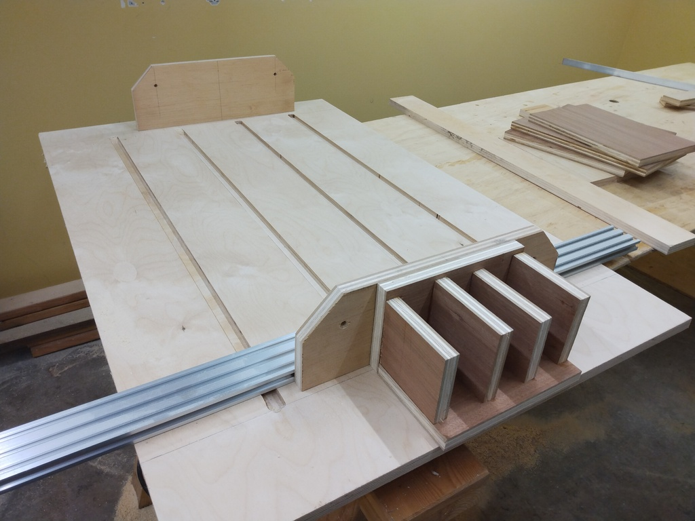
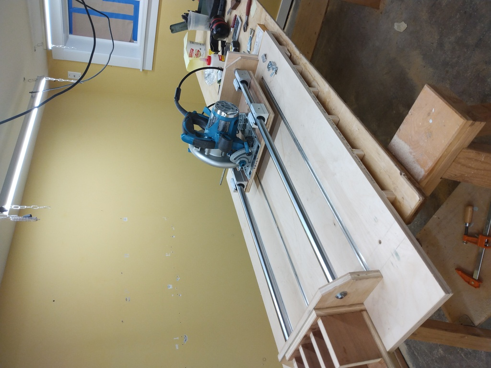
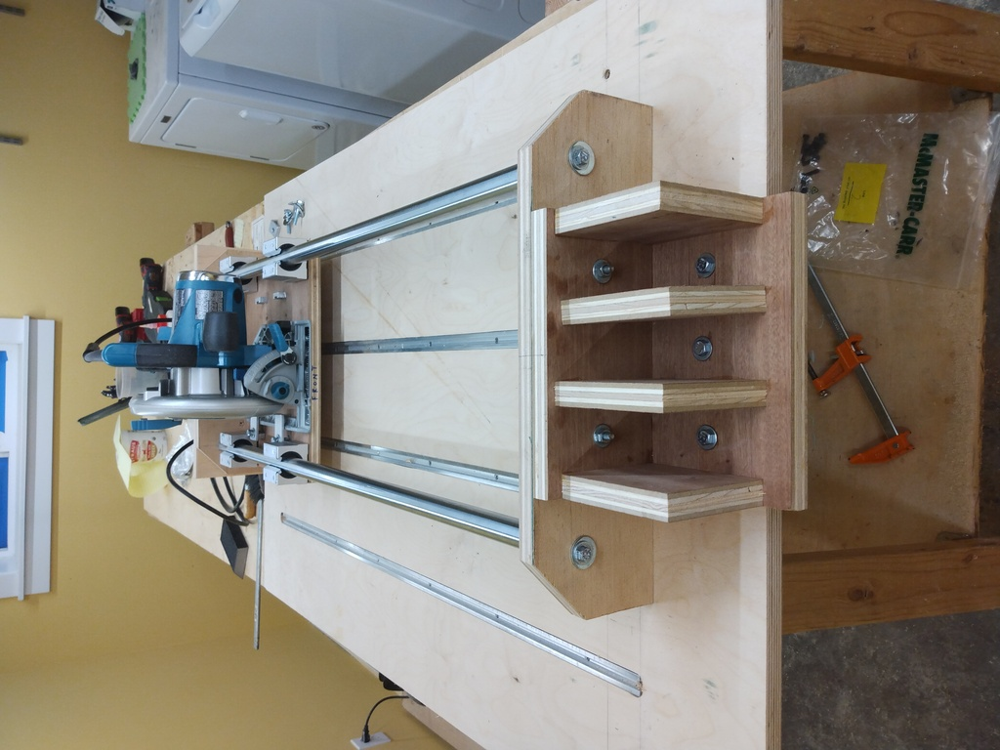
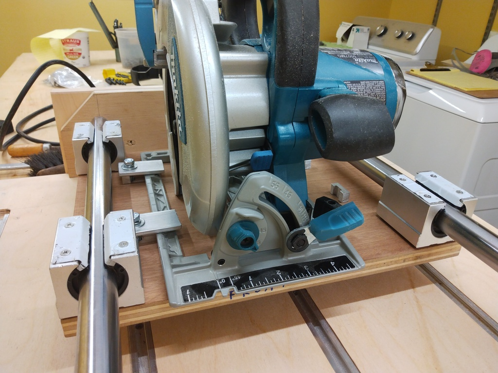
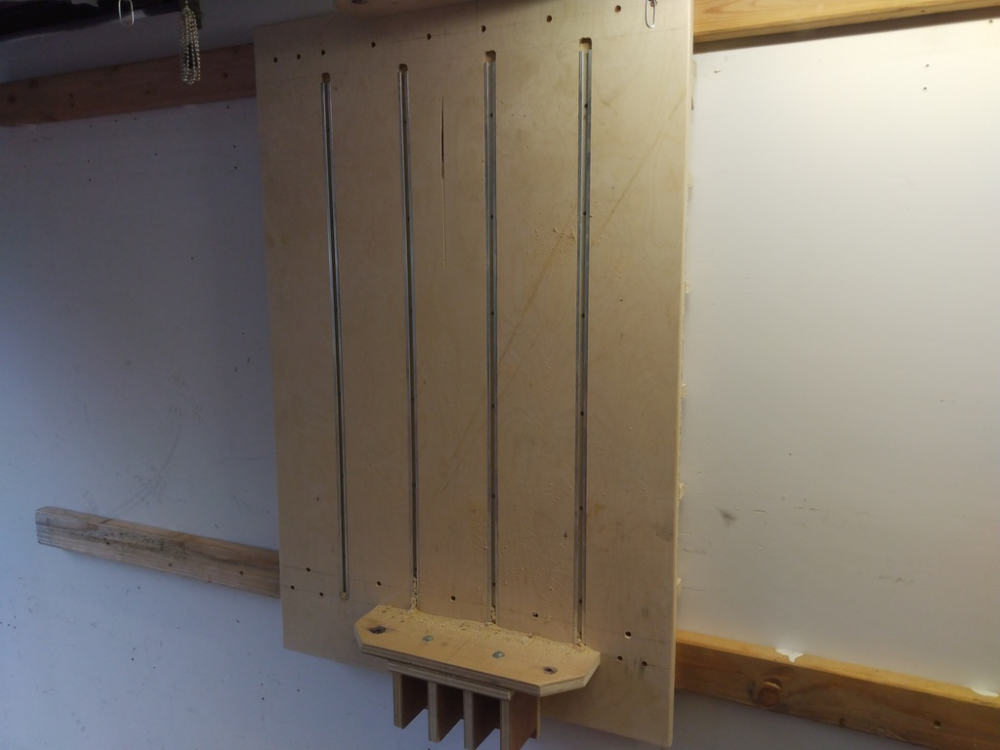
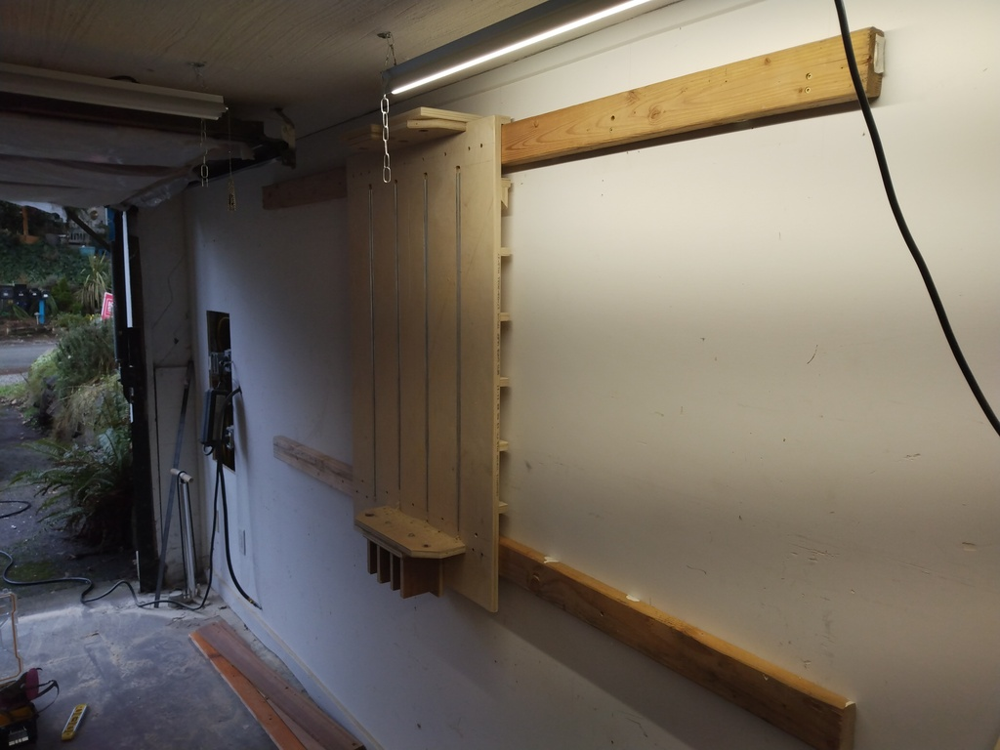
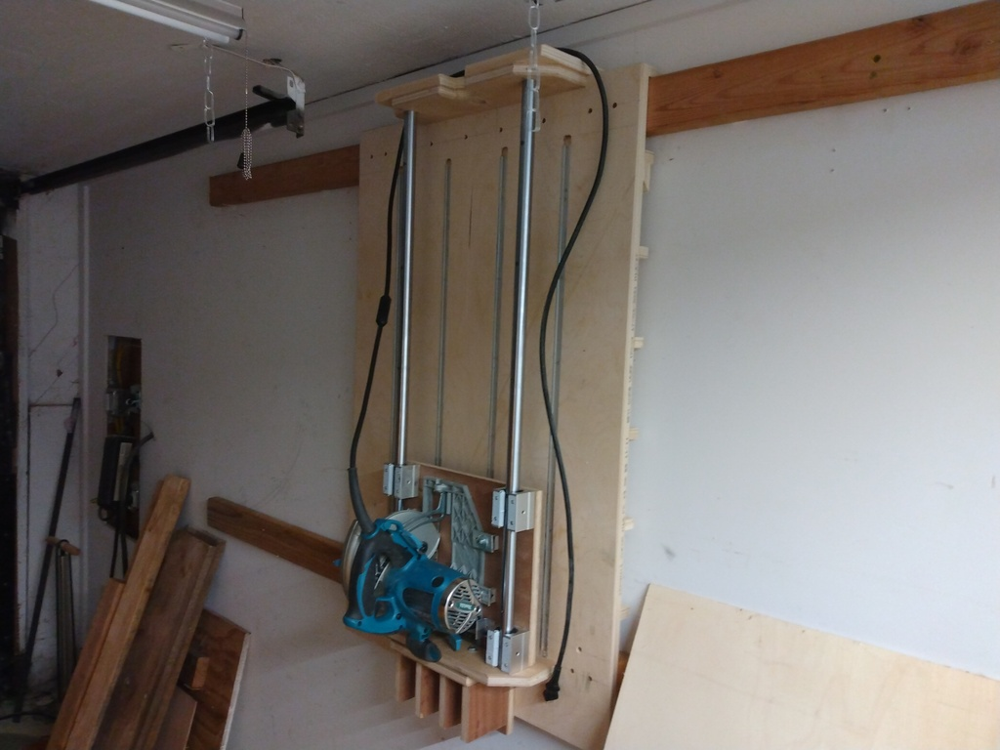
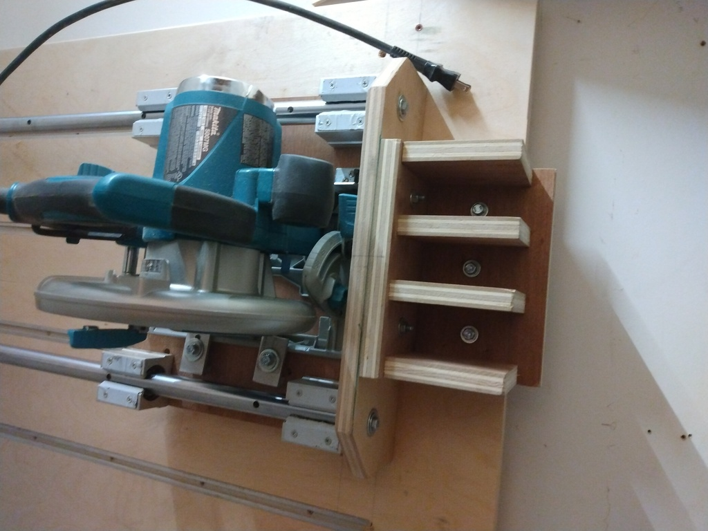

# panel saw

Panel saws are cool.

See: [jisakukobo](https://www.youtube.com/c/jisakukobo/videos) for where I'm 
drawing my inspiration from.

## current implementation

I abandoned the CAD drawings for this project as I couldn't learn FreeCAD
quickly enough. Instead, I just eyeballed things and used a calculator, pencil,
and paper. The end result was pretty good, though I will definitely rebuild 
part of the panel saw, using the panel saw and table saw... as well as making
some CAD drawings. The current saw is nearly perfect... *but* the distance
between the bottom of the saw carriage and the saw bed limits the stock size
to just under 1.5". WaWaaa. So I cannot cut 2x lumber with this saw. However,
this is an easy fix, as nothing in the current implementation is glued.

## fixed

TODO...
