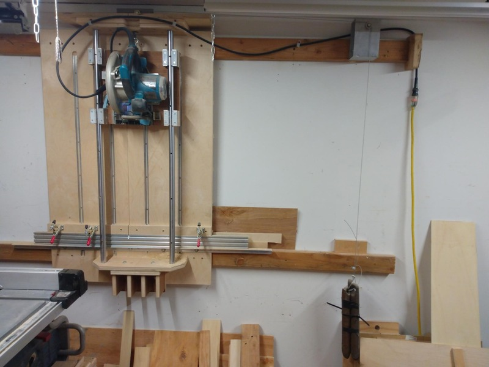
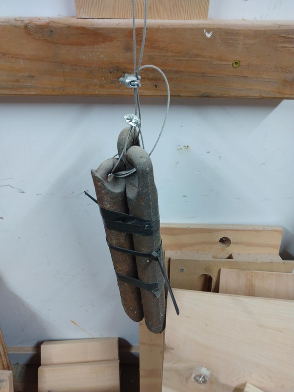
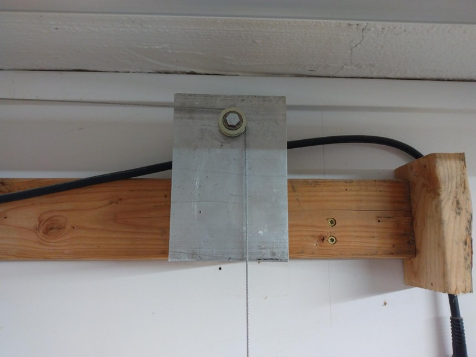
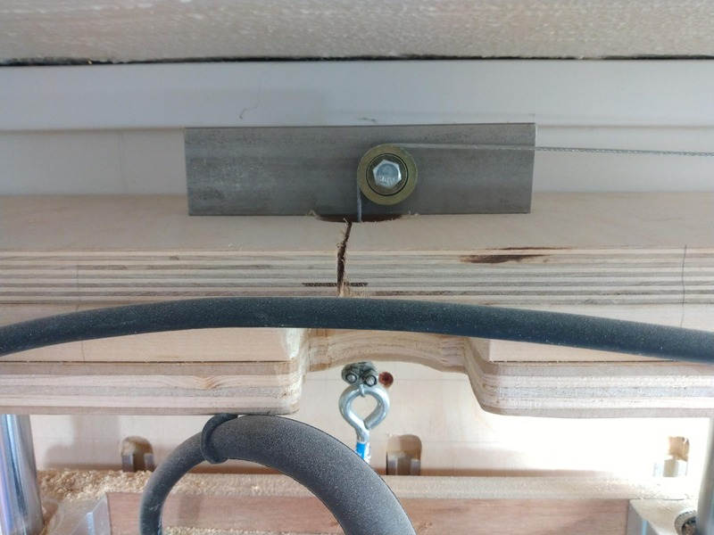
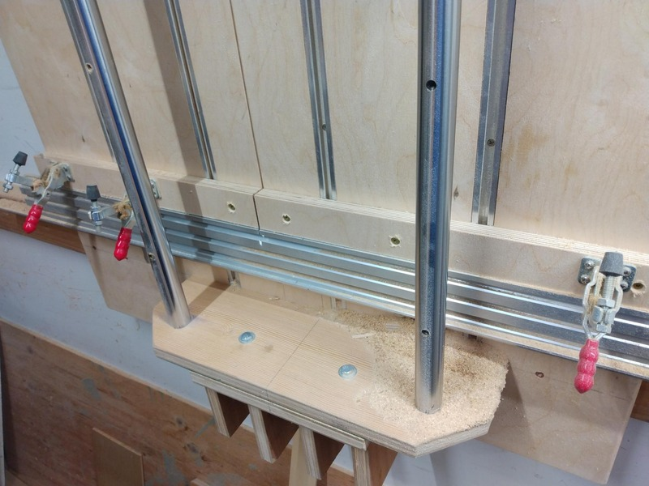

# panel saw

Panel saws are cool.

See: [jisakukobo](https://www.youtube.com/c/jisakukobo/videos) for where I'm 
drawing my inspiration from.

## current implementation

I abandoned the CAD drawings for this project as I couldn't learn FreeCAD
quickly enough. Instead, I just eyeballed things and used a calculator, pencil,
and paper. The end result was pretty good, though I will definitely rebuild 
part of the panel saw, using the panel saw and table saw... as well as making
some CAD drawings. The current saw is nearly perfect... *but* the distance
between the bottom of the saw carriage and the saw bed limits the stock size
to just under 1.5". WaWaaa. So I cannot cut 2x lumber with this saw. However,
this is an easy fix, as nothing in the current implementation is glued.

## fixes

I had to fix some things.

* 

I am using counter weights that are old window sash weights:

* 

Three of these are a perfect counter weight to the panel saw sled, but it was too heavy for the cheap metal brackets I purchased for the
metal pulleys (which are just cheap metal doo-dads for a sliding door, iirc).

* 
* 

What you see above are stout pieces of scrap metal I had on hand. I had no plan, just a drill and some bolts.

Below is the fence and, strangely, a wood fence above it. So with the current design, at full extension, the
saw blade was not making a full cut through the aluminum fence. So I shimmed the fence out with a piece of 
plywood. This had the added benefit of giving me an easy place to screw down the (admitedly cheap and flimsy)
hold down clamps. I'll be upgrading all of this over time, but for now, it works great.

* 
