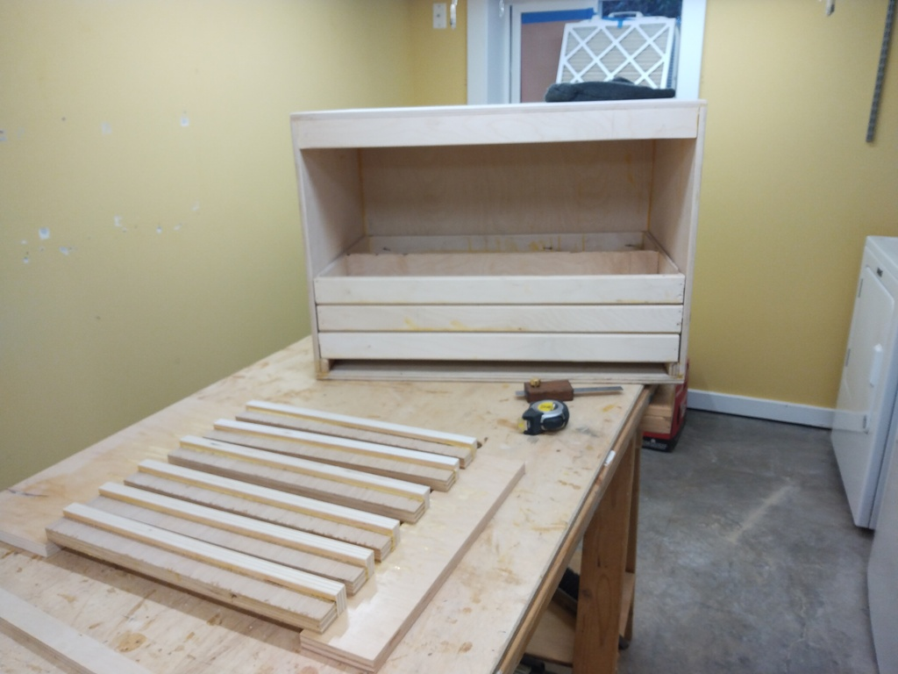
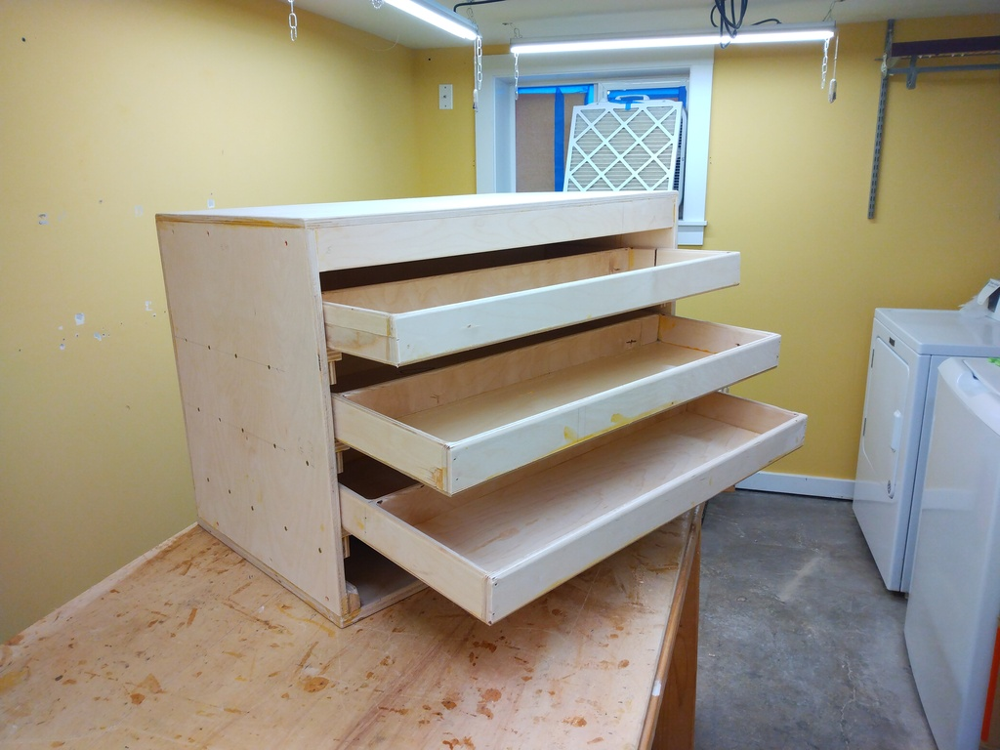
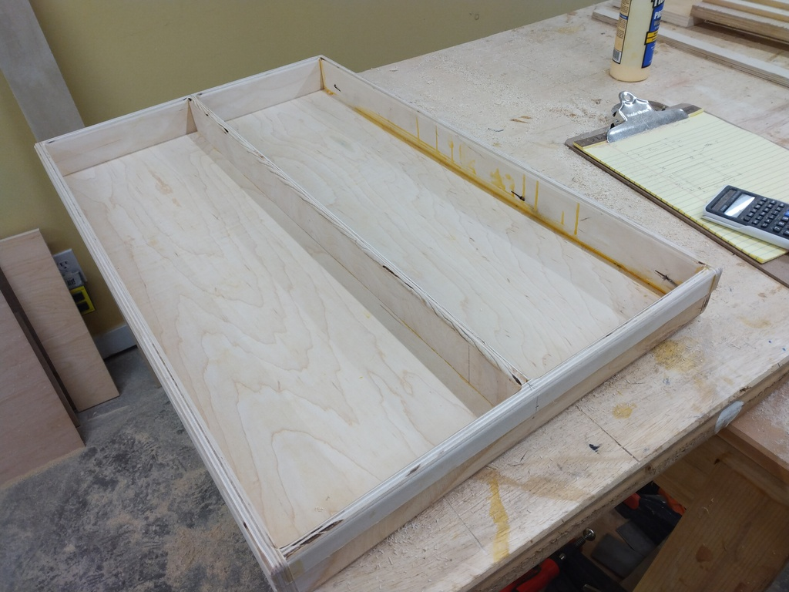
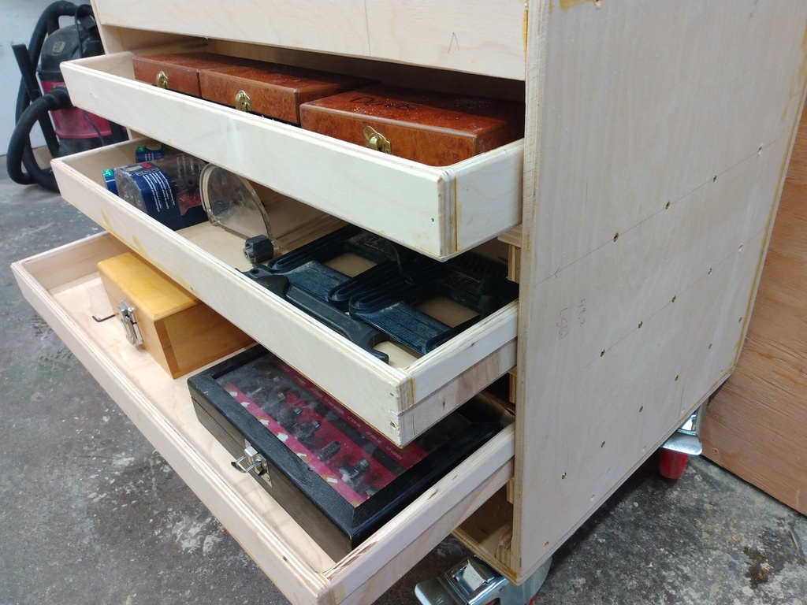
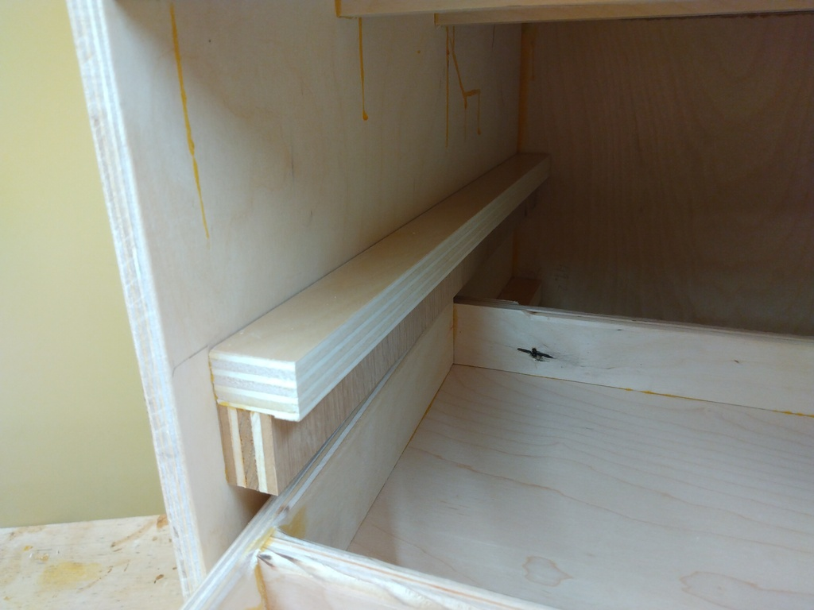
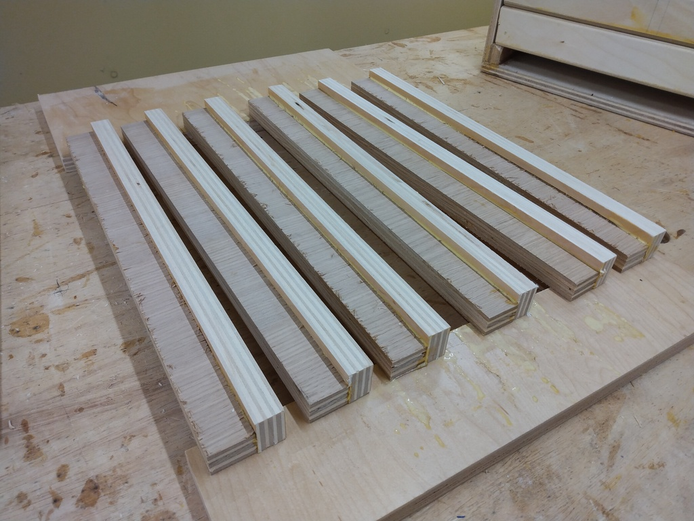
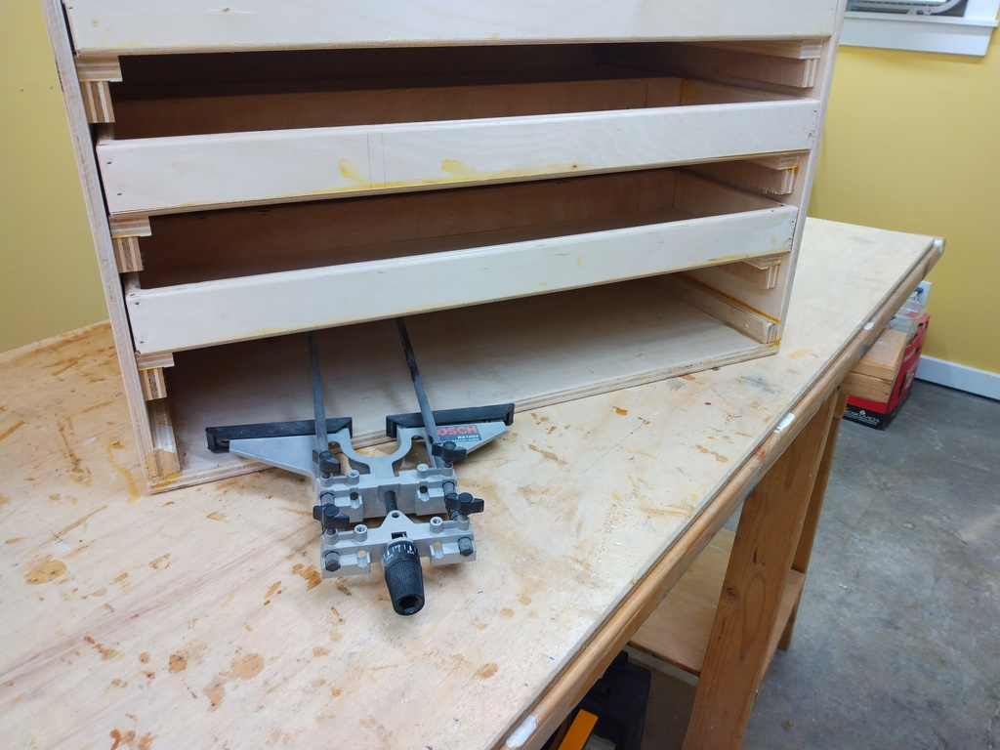
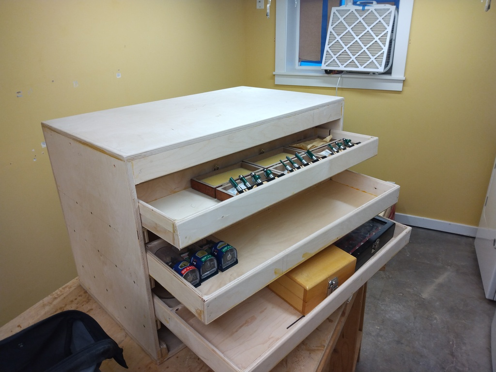
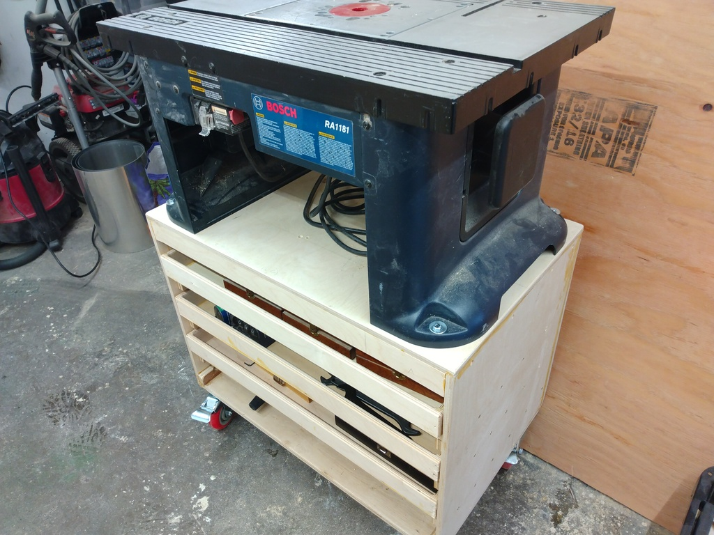

# router table cabinet

I need a cabinet to put the router table on... and a place to store my router bits.

## implementation

* 
* 
* 
* 

Notice the salvaged wood used for the rails. This stuff is from a cabinet shop and has a very slippery surface. I'm 
hoping it will wear well over time. But for right now, the drawers have very low friction for opening and closing.

* 
* 

It's nice to have a place to put the little bits:

* 
* 
* 
