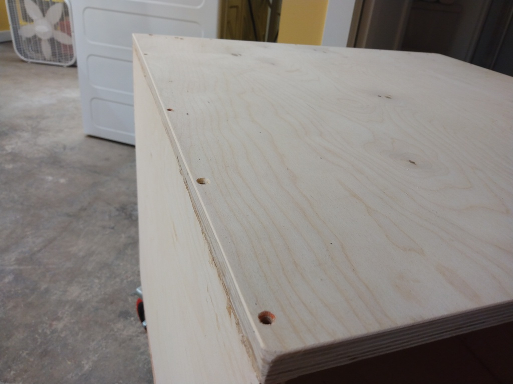
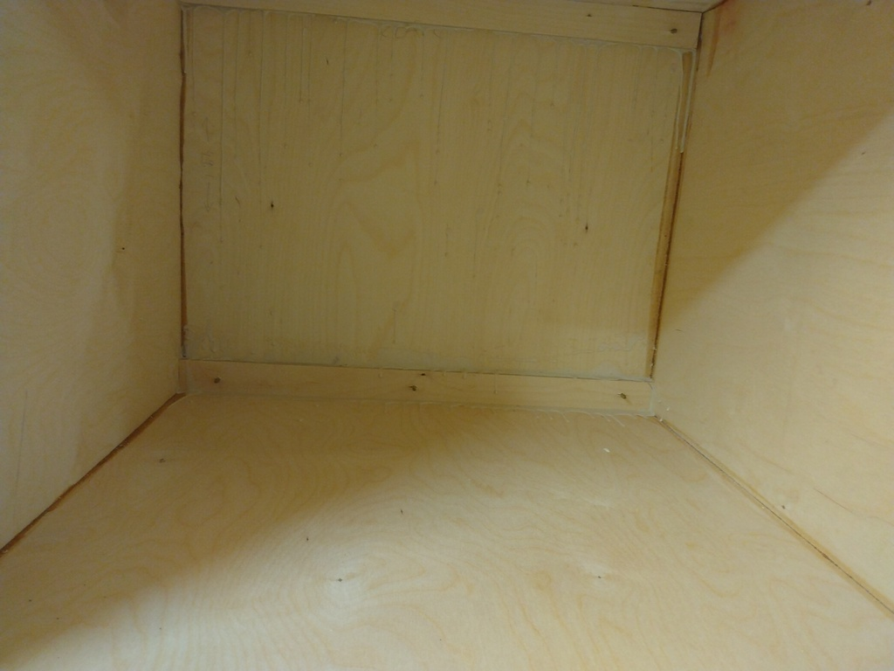
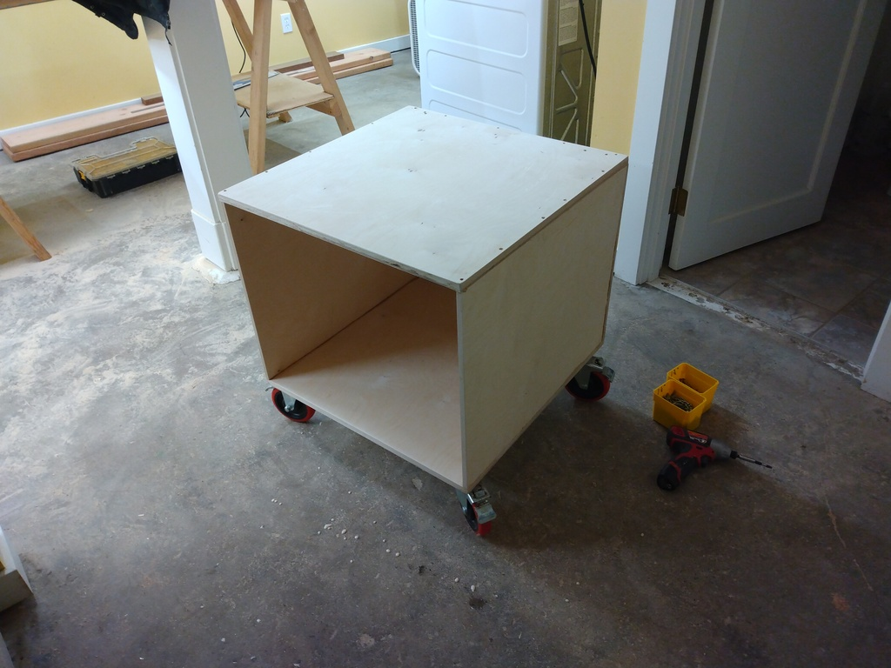
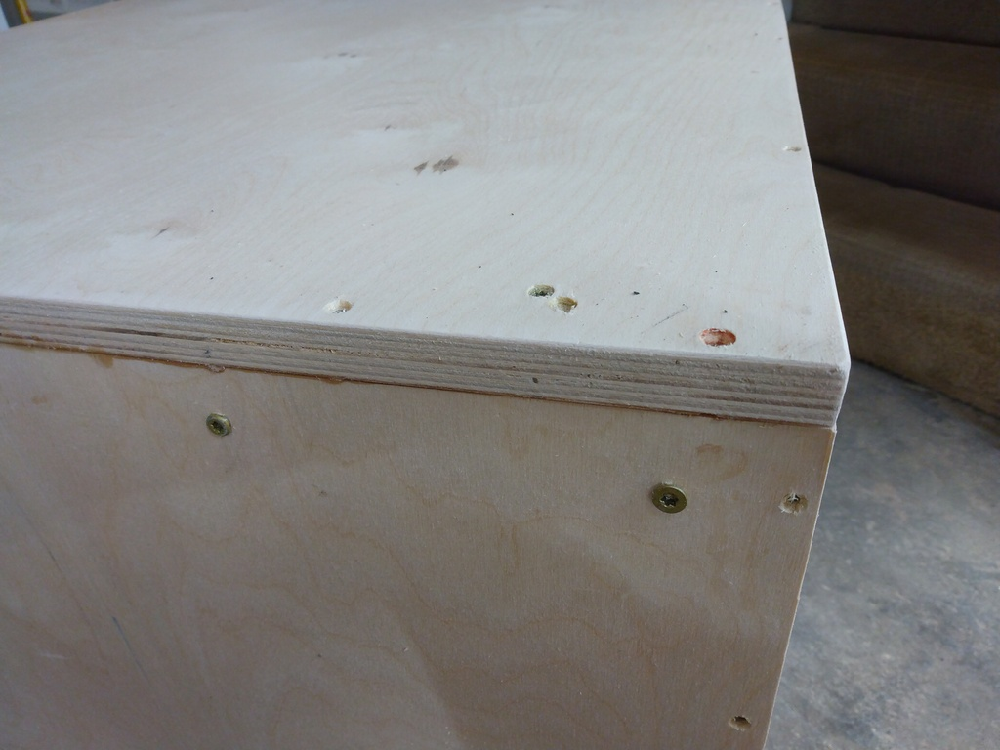
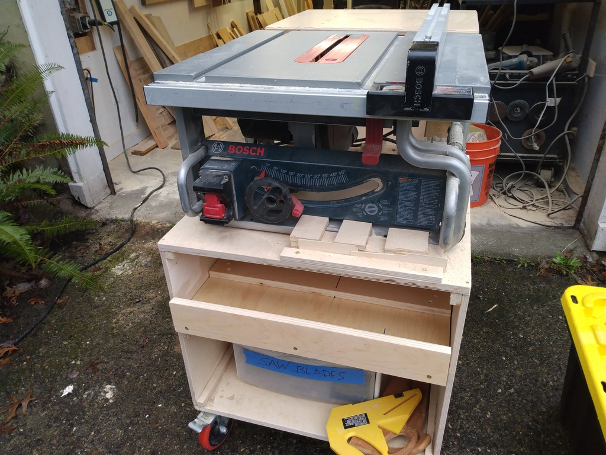
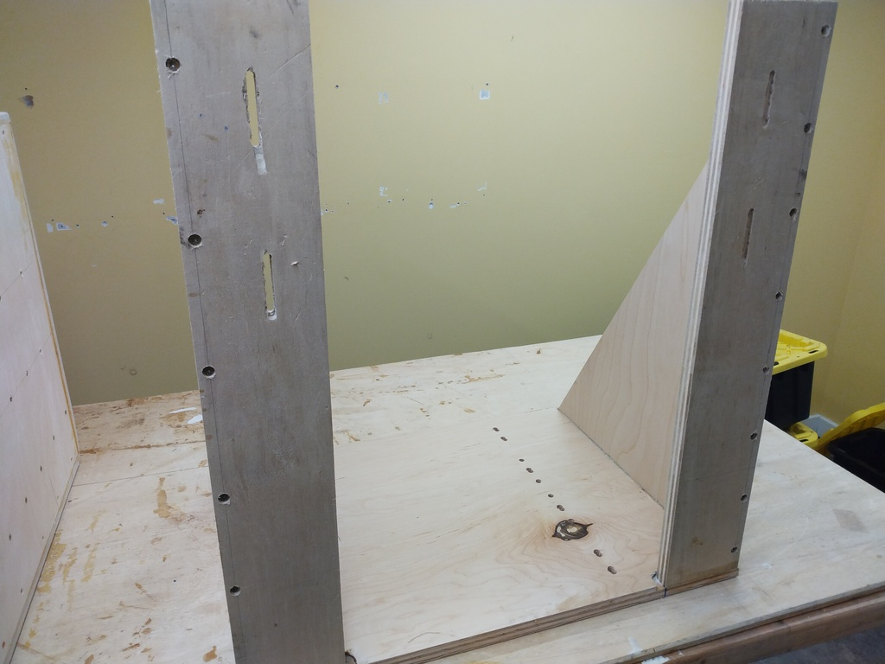
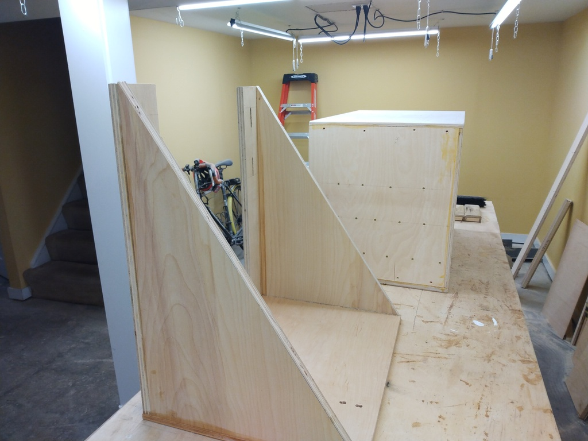
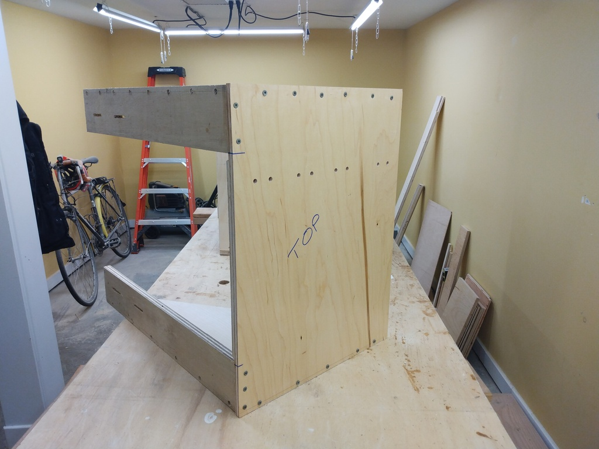
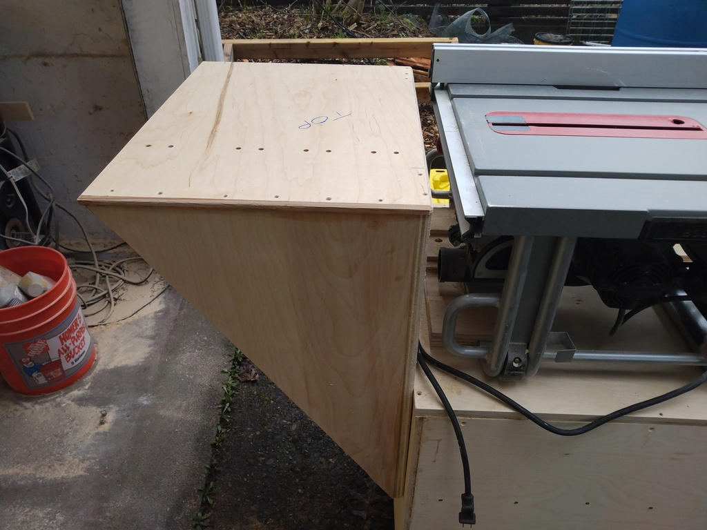
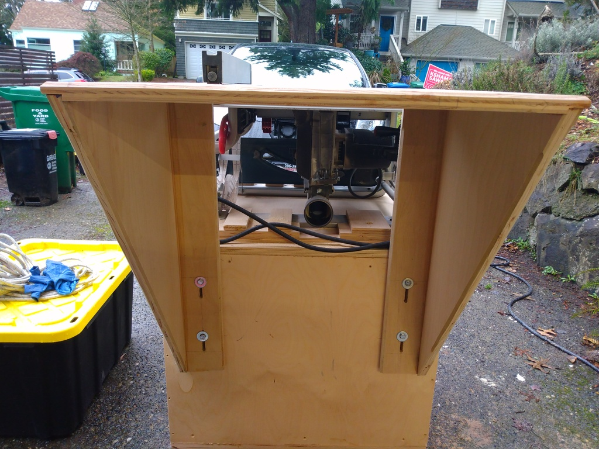

# table saw cabinet

My shop has limited space. But I have a nice driveway. In the summer I like to work outside in the driveway.
So having rolling cabinets that allow me to easily re-configure my shop space is really attractive to me.

## outfeed height

I settled on 101.5cm b/c I goofed and that's what I built. And I kinda like that height.

## implementation

* 
* 

I don't have clamps big enough for these cabinets, so I use a screw and glue technique. Screws hold everything together
while things dry, and I remove them after everything has set up.

* 
* 
* 

Of course, the saw is totally unsafe without an outfeed, so here I just whipped one up out of scrap:

* 
* 
* 

And this is what it looks like installed:

* 
* 

Some 1/4-20 bolts and threaded inserts hold the outfeed to the cabinet. Easy.

Done.
